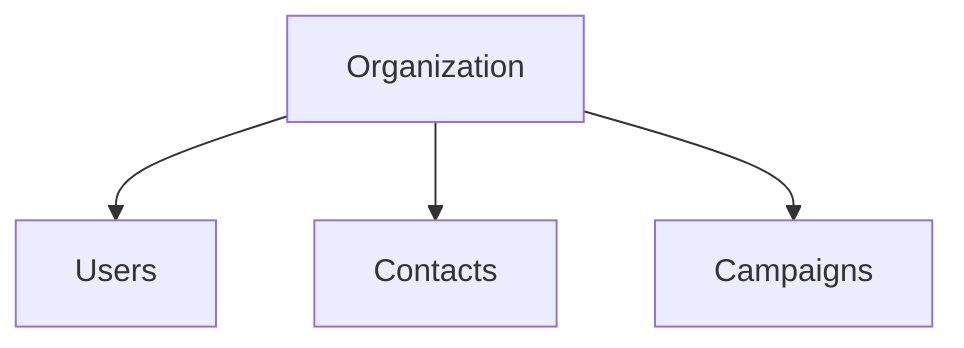
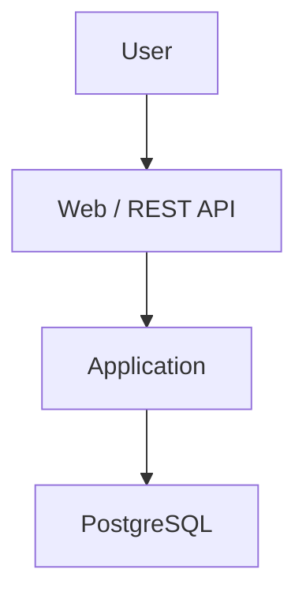
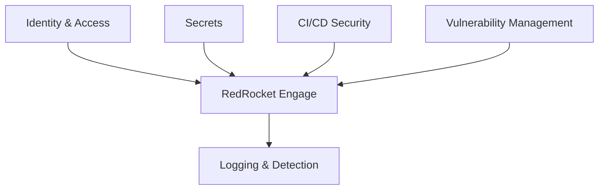

# Architecture

The first RedRocket Engage architecture will stay intentionally small.

The goal is obviously not to build a complex cloud platform.

The goal is to understand every important component, why it exists, what it
protects and what could happen if it fails or gets compromised.

## Product model

RedRocket Engage is a multi-tenant SaaS application.

Each customer has its own organization.

Every user, contact and campaign belongs to an organization.

This makes **tenant isolation** one of the most important security properties
of the platform.

A user from one organization must never be able to access data belonging to
another organization.

## Initial application architecture

The first version will remain simple:

No real email delivery yet.

That's probably a topic for a future lab.

## Security around the application

Security capabilities will be added progressively around the core platform.

The exact technologies will be chosen when there is a clear reason for them.

## What the architecture must protect

The design should primarily protect:

- customer contacts
- tenant isolation
- administrative accounts
- API credentials and application secrets
- production access
- the CI/CD pipeline

These come directly from the business context and will drive the technical
security decisions.

## Main trust boundaries

Even with a small architecture, several trust boundaries already exist.

### Internet to application

The application is exposed to users through the Internet.

Input cannot be trusted by default.

### User to tenant

Authentication proves who a user is.

Authorization must also determine what that user is allowed to access inside
their organization.

### Application to database

The application needs access to customer data.

That access should be limited to what the application actually requires.

### Engineering to production

Engineers may need privileged access to operate the platform.

That access should be controlled, limited and traceable.

### CI/CD to production

The delivery pipeline may eventually have the ability to modify production.

That makes the pipeline itself part of the security perimeter.

## Design principles

### Understand before adding complexity

Do not add a cloud service, security tool or abstraction unless there is a clear
problem it helps solve.

### Business first

Technical decisions should remain connected to what RedRocket actually needs
to protect.

### Least privilege

Users, applications and automation should only receive the access they need.

### Tenant isolation by design

Tenant isolation should not depend on developers remembering to apply a filter
in every request.

It should become a property of the architecture that can be tested.

### Security progressively

The first version does not need to be perfect.

Build something understandable first, identify the risks, then introduce controls
and measure what they actually change.

### Keep security human

Controls should be understandable to the people who use and operate them,
maintainable and proportionate to the risk.

## First technical question

Before choosing the first AWS services, the next question is:

**What is the smallest architecture that can run RedRocket Engage while keeping
the application, data and trust boundaries understandable?**
The architecture will be designed from that context.
