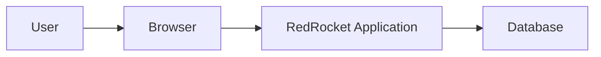

# SaaS Security Lab

This project explores a simple **Security by Design** approach through the construction of a small SaaS application.

RedRocket Engage 🚀 is a fictional multi-tenant B2B SaaS. The objective is not to build a complete security architecture or apply a catalogue of controls.

The project starts from the value the product is meant to create for the customer, identifies what must remain true for that value to survive, then observes where the design and implementation can put it at risk.

The approach is deliberately simple:

**Understand → Sketch → Identify → Build → Observe → Iterate**

## Start with business value

Small B2B teams often manage customer information across spreadsheets, shared files and disconnected tools.

RedRocket provides a common workspace where an organization can manage its users, contacts and campaigns.

Its value comes from centralizing customer information and making it available to the right people.

That value also creates dependency and trust.

If RedRocket exposes one customer's data to another, gives privileged control to the wrong person or turns a limited compromise into a broad one, the product is no longer preserving the value it was built to create.

Security therefore starts before the first technical choice.

More detail is available in [Business Context](docs/business-context.md).

## Three security objectives

The first version of RedRocket is intentionally scoped around three security objectives.

### 1. Preserve customer boundaries

**Value at stake:** trusted centralization of customer data.

Customer data must remain accessible to the right organization and isolated from other organizations.

**Critical failure outcome:** unauthorized access to customer data.

---

### 2. Preserve authorized control

**Value at stake:** trusted use of RedRocket's business capabilities.

Privileged actions must remain under the control of authorized users.

**Critical failure outcome:** unauthorized privileged control.

---

### 3. Limit the impact of compromise

**Value at stake:** concentrating customer data and operations in one service must not create unnecessary exposure.

A limited compromise should not automatically provide broad access to the rest of RedRocket or its data.

**Critical failure outcome:** broad compromise from a limited foothold.

---

These objectives are derived from the value and trust created by the product. They are not the result of a security framework.

More detail is available in [Security Objectives](docs/security-objectives.md).

## Security by Design

The lab follows a simple line of reasoning:

```text
Business value
    ↓
What must remain true?
    ↓
Security objective
    ↓
Where can the design put it at risk?
    ↓
Concrete problem
    ↓
Smallest appropriate treatment
    ↓
Evidence
```

A security objective can exist before any technical decision.

A concrete security problem appears later, when the design or implementation creates a real path towards a critical failure outcome.

This distinction is important: the lab does not start by inventing controls for hypothetical problems.

## Architecture

The first architecture is deliberately small:



The initial deployment is a monolith with one application and one database.

Architecture decisions are kept minimal. Their security implications are examined only when they affect one of the security objectives.

See [Architecture Foundations](docs/architecture-foundations.md).

## RedRocket MVP

An organization can:

- manage users
- manage contacts
- create and manage draft campaigns

Two roles are enough:

- **Member**
- **Admin**

There is no public registration, email delivery, public API, billing or external integration in the first version.

See [Minimum Viable Product](docs/mvp.md).

## Deliverable

RedRocket will become a small working application accompanied by its architecture decisions, security observations and tests.

```text
saas-security-lab/
├── app/
├── tests/
├── docs/
│   └── adr/
├── Dockerfile
└── README.md
```

The application and its security tests will later be reused as a workload for a separate DevSecOps lab.

This repository focuses on understanding the value, designing the product, identifying concrete security problems and treating them.

The DevSecOps lab will focus on continuously verifying that these security properties remain valid during development.

## Current status

Defined:

- business problem and value
- MVP
- three security objectives
- architecture foundations
- ADR process
- monolithic architecture

Next:

**Choose the minimum application stack and start building.**

Documentation:

- [Business Context](docs/business-context.md)
- [Security Objectives](docs/security-objectives.md)
- [Architecture Foundations](docs/architecture-foundations.md)
- [Minimum Viable Product](docs/mvp.md)
- [Roadmap](ROADMAP.md)
- [Architecture Decisions](docs/adr/)
