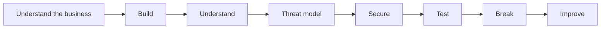

# SaaS Security Lab

A hands-on project to understand how security fits into a modern SaaS environment.

This is a part of cybersecurity I haven't explored as deeply as infrastructure,
Linux or IT/OT yet.

So I'm approaching it the way I learn best: **start from a blank page, build something,
understand how it works, secure it, test it, break things when needed, and improve it.**

The goal is not to pretend I already know everything about SaaS security.

The goal is to understand it by doing it.

## Why this lab?

I'm interested in what happens when you have to build a security function around
a real product rather than around individual technologies.

That means looking at the whole picture:

- the business
- the application
- cloud infrastructure
- identities and access
- software delivery
- vulnerabilities
- logging and detection
- incident response
- risk
- customer trust

Not just security tools.

## What I want to explore

- AWS and cloud security
- IAM and least privilege
- application and API security
- threat modeling
- secrets management
- vulnerability management
- logging and detection
- container security
- infrastructure as code (IaC)
- CI/CD security
- SAST, SCA and DAST
- incident response
- security governance

## The approach

Security does not start with a scanner.

It starts with understanding what matters, what is at stake, the systems that
support the business, the risks, the constraints and, above all, the people who
rely on them.

## The red rocket

I see this project a little like my red rocket 🚀

A trip into parts of security I haven't explored deeply yet, built the way I like
to learn: from a blank page and with my hands on the system.

No shortcuts.

## Current status

**Starting from scratch.**

First step: understand the fictional SaaS business before choosing the architecture.

## Build. Break. Understand. Rebuild better.
