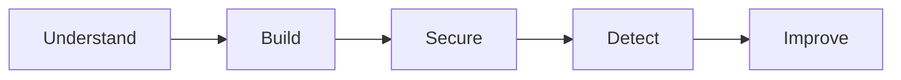

# SaaS Security Lab

A hands-on project to understand how security fits into a modern SaaS environment.

The fictional product is **RedRocket Engage**, a small multi-tenant B2B SaaS application
where companies can manage contacts and prepare simple marketing campaigns.

This is a part of cybersecurity I haven't explored as deeply as Linux, infrastructure
or IT/OT yet.

So I'm approaching it the way I learn best: start from a blank page, build something,
understand how it works, secure it, test it, break things when needed, and improve it.

The goal is not to pretend I already know everything about SaaS security.

The goal is to understand it by doing it.

## The product

RedRocket Engage stays intentionally small.

A customer organization can:

- manage users
- manage contacts
- create campaigns
- use a REST API

No real email delivery yet. That's probably a topic for a future lab.

The application is just complex enough to explore real SaaS security problems without
spending weeks building the product itself.

## What I want to explore

- multi-tenant security
- authentication and authorization
- RBAC
- API security
- AWS and cloud security
- IAM and least privilege
- secrets management
- vulnerability management
- SAST and SCA
- CI/CD security
- logging and detection
- incident response

## Approach

Security starts with understanding the business first:

what matters, what is at stake, the systems that support it, the risks,
the constraints and, above all, the people who rely on them.

## The red rocket

This is my red rocket project 🚀

A trip into parts of security I haven't explored deeply yet, using the way
I learn best: hands-on, from a blank page.

## Current status

**Step 1: Understand the business**

The product, users, sensitive data and main security concerns are being defined.

See [Business Context](docs/business-context.md).

## Build. Break. Understand. Rebuild better.
