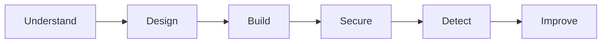

# SaaS Security Lab

A hands-on project to understand how security fits into a modern SaaS environment.

The fictional product is **RedRocket Engage**, a small multi-tenant B2B SaaS application
where companies can manage contacts and prepare simple marketing campaigns.

This is a part of cybersecurity I haven't explored as deeply as Linux, infrastructure
or IT/OT yet.

So I'm approaching it the way I learn best: start from a blank page, understand the
problem, build something, test it, break things when needed, and improve it.

The goal is not to pretend I already know everything about SaaS security.

The goal is to understand it by doing it.

## The product

RedRocket Engage stays intentionally small.

A customer organization can:

- manage users
- manage contacts
- create campaigns
- use a REST API

No real email delivery yet. That's probably a topic for a future lab.

The application is just complex enough to explore real SaaS security problems without
spending weeks building the product itself.

## Approach

I want to understand SaaS security from the foundations up.

Starting from a blank page means resisting the temptation to jump directly
to security tools, frameworks or advanced cloud architecture.

The first questions are much simpler:

- What are we building?
- Who will use it?
- What data will it handle?
- What is the smallest architecture that can make it work?
- What does each component have to trust?
- What security problems already appear at that point?

Before writing the application, the first security problems are already visible
in its design.

Only then does it make sense to build.

The MVP will create new questions, and those questions will drive the next
security decisions.

I would rather understand the first 50 cm properly than jump straight to 1.5 m
without understanding what is underneath.

## What I want to explore

- multi-tenant security
- authentication and authorization
- RBAC
- API security
- AWS and cloud security
- IAM and least privilege
- secrets management
- vulnerability management
- SAST and SCA
- CI/CD security
- logging and detection
- incident response

These topics are not a checklist.

They should appear because the architecture or the application creates a real
security problem that needs to be understood.

## The red rocket

This is my red rocket project 🚀

A trip into parts of security I haven't explored deeply yet.

Starting from a blank page means facing the same questions architects and
developers face: what are we building, for whom, with what data, how should
users access it, and how should the different parts of the system trust each other?

## Current status

**Step 2: Design the foundations**

The business context is defined.

The current work is focused on the smallest possible architecture and the first
security problems that appear before writing the MVP.

See:

- [Business Context](docs/business-context.md)
- [Architecture Foundations](docs/architecture-foundations.md)
- [Roadmap](ROADMAP.md)

## Build. Break. Understand. Rebuild better.
