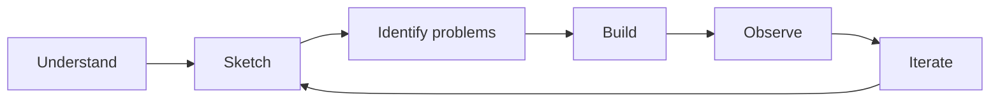

# SaaS Security Lab

This project explores a simple **Security by Design** approach through the construction of a small SaaS application.

RedRocket Engage 🚀 is a fictional multi-tenant B2B SaaS. The objective is not to build a complete security architecture, nor to apply a catalogue of controls. The project starts from the business problem, identifies what creates value for the customer, observes where security problems appear in the design, and improves the product progressively.

The approach is deliberately simple:

> **Understand → Sketch → Identify problems → Build → Observe → Iterate**

## Business context

Small B2B teams often manage customer information across spreadsheets, shared files and disconnected tools. RedRocket provides a common workspace where an organization can manage its users, contacts and campaigns.

Its value comes from centralizing customer information and making it available to the people who need it. In return, customers entrust RedRocket with business data and business operations.

This creates several expectations: customer data must remain separated between organizations, privileged functions must remain under authorized control, and a limited compromise should not automatically expose the whole service.

The security work starts from these business expectations.

More detail is available in [Business Context](docs/business-context.md).

## Security scope

RedRocket is intentionally scoped around **three critical security outcomes**.

They represent the three situations we primarily want to prevent during the first iterations of the lab.

### 1. Unauthorized access to customer data

**Attacker goal:** access data belonging to another organization.

A user from one organization must not be able to access data belonging to another organization.

---

### 2. Unauthorized privileged control

**Attacker goal:** obtain or abuse administrative capabilities.

Privileged functions must remain under the control of authorized users.

---

### 3. Broad compromise from a limited foothold

**Attacker goal:** turn a limited compromise into wider access.

Compromising one part of RedRocket should not unnecessarily provide access to the rest of the application or its data.

---

These three outcomes do not attempt to represent every possible SaaS threat. They provide a deliberately limited scope that is sufficient to demonstrate the Security by Design reasoning of the lab.

## Security by Design

Security is approached from the product and its architecture rather than from tools.

The project does not begin with a security framework, a predefined control set or a security stack. It first asks what the product is trying to achieve, what the customer entrusts to it, what could materially damage that value, and where the design creates a path towards that outcome.

Only then is a treatment considered.



A security topic is therefore introduced only when the product or architecture gives it a reason to exist.

## From risk to implementation

Each problem should remain traceable to a business concern.

The reasoning is kept intentionally short:

```text
Business value
    ↓
Critical risk
    ↓
Where does it appear?
    ↓
Why does the current design allow it?
    ↓
What is the smallest appropriate treatment?
    ↓
Can we demonstrate that it works?
```

For example, customer data has value and must remain isolated between organizations. If a resource is retrieved only from its identifier, without checking its organization, a cross-tenant access path appears.

The treatment is then introduced where the problem exists, and an automated test demonstrates that the unwanted access is no longer possible.

The objective is not to showcase the control itself. The objective is to make the reasoning from business requirement to technical decision visible.

## RedRocket MVP

RedRocket remains intentionally small.

An organization can manage users and contacts, and create campaigns. There is no real email delivery at this stage.

The first architecture is deliberately simple: one application, one database and a monolithic deployment. Additional components will only be introduced when the product requires them.

The application needs only enough functionality to expose meaningful security problems and allow their treatment to be demonstrated.

## Deliverable

The project will result in a small working application accompanied by its architecture decisions, security observations and tests.

The repository is expected to remain simple:

```text
saas-security-lab/
├── app/
├── tests/
├── docs/
│   └── adr/
├── Dockerfile
└── README.md
```

The application and its security tests will later be reused as a workload for a separate DevSecOps lab.

This repository therefore focuses on understanding the business, designing the product, identifying security problems and treating them. The DevSecOps lab will focus on continuously verifying that these security properties remain valid during development.

## Current status

The business problem, MVP, architecture foundations, critical security outcomes and first architecture decisions are defined.

The next step is to choose the minimum application stack and start building.

Documentation:

* [Business Context](docs/business-context.md)
* [Architecture Foundations](docs/architecture-foundations.md)
* [Minimum Viable Product](docs/mvp.md)
* [Security Problems](docs/security-problems.md)
* [Roadmap](ROADMAP.md)
* [Architecture Decisions](docs/adr/)
