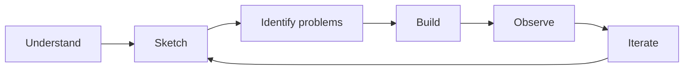

# SaaS Security Lab

A hands-on project to understand how security fits into a modern SaaS
environment.

**RedRocket Engage** is a small fictional multi-tenant B2B SaaS application.
I start from a blank page, build the smallest useful product, observe the
security problems that appear, and improve it step by step.

If you just want to know what can be broken today, run a penetration test.
Here, the goal is to understand why security problems appear in the first
place and how security can be built into the product from the beginning.

This is **Security by Design**.

## The product

RedRocket Engage stays intentionally small. A customer organization can manage
users, contacts and campaigns. No real email delivery yet. That's probably a
topic for a future iteration.

The application is just complex enough to explore real SaaS security problems
without spending weeks building the product itself.

## Approach

The idea is simple: start from the foundations and avoid jumping directly to
security tools, frameworks or advanced cloud architecture.

First, understand what we are building, who will use it, what data it will
handle, what the smallest architecture looks like, what each component has to
trust, and what security problems already appear. External requirements may
also shape the product: customers subject to NIS2, for example, may expect
specific security requirements from their SaaS providers.

The first security problems are visible before writing code. The MVP will
create new questions, and those questions will drive the next security
decisions.

I'd rather understand the first 50 cm properly than jump straight to 1.5 m
without understanding what is underneath.

## What I want to explore

As RedRocket grows, the project may lead into areas such as multi-tenant
security, authentication and authorization, RBAC, API security, cloud security,
IAM, secrets management, vulnerability management, CI/CD security, logging,
detection and incident response.

These topics are not a checklist. They should appear because the product or
architecture creates a real problem that needs to be understood.

## Current status

The business context and first architecture foundations are defined. The
current work is focused on the smallest possible MVP and the first security
problems visible before coding.

See [Business Context](docs/business-context.md),
[Architecture Foundations](docs/architecture-foundations.md),
[Security Problems](docs/security-problems.md), [Roadmap](ROADMAP.md) and
[Architecture Decisions](docs/adr/).

## Build. Break. Understand. Rebuild better.
