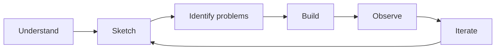

# SaaS Security Lab

A hands-on project to demonstrate a simple **Security by Design** approach on a small SaaS application.

**RedRocket Engage** is a fictional multi-tenant B2B SaaS. I start from a blank page, build the smallest useful product, identify where critical security risks appear in the design, and improve it step by step.

The goal is not to build a complete SaaS security architecture or apply a security checklist.

The goal is to understand **what needs to be protected, where risk appears, and how the design can reduce it**.

> **Understand first. Build. Observe. Improve.**

## The product

RedRocket Engage stays intentionally small.

A customer organization can:

* manage users
* manage contacts
* create campaigns

No real email delivery yet. The application only needs enough functionality to expose meaningful SaaS security problems.

The first version is a monolith with one application and one database.

## Security by Design

Security starts with the product and its architecture, not with tools.

Before choosing controls, we first understand:

* what we are building
* who uses it
* what data it handles
* what needs to be trusted
* what an attacker could gain
* where the design makes that possible

Then we build.

New security questions are documented when the product or architecture gives them a reason to exist.



This keeps the project deliberately small.

No control is added simply because it is considered a security best practice. It needs to solve a problem that RedRocket actually has.

## Three critical risks

For the first iterations, RedRocket focuses on three security outcomes that should not be possible.

### 1. Unauthorized access to customer data

A user from one organization must not be able to access data belonging to another organization.

This makes tenant isolation and authorization part of the product design, not just implementation details.

### 2. Unauthorized privileged control

An attacker must not be able to obtain or abuse administrative capabilities.

As privileged functions appear in RedRocket, we will identify where that trust is created and how it should be constrained.

### 3. Broad compromise from a limited foothold

Compromising one part of RedRocket should not unnecessarily provide access to the rest of the application or its data.

Architecture decisions such as application privileges, database access and component trust will be examined when they create this risk.

These three risks are not intended to represent every possible SaaS threat.

They give the lab a small and concrete security scope.

## From risk to evidence

Each security problem should follow the same reasoning:

```text
Critical risk
     ↓
Where does it appear?
     ↓
Why does the current design allow it?
     ↓
What is the smallest appropriate treatment?
     ↓
Can we demonstrate that it works?
```

For example:

```text
Risk
Customer A accesses Customer B's data

        ↓

Design / implementation
A resource is retrieved only by its ID

        ↓

Problem
Tenant ownership is not verified

        ↓

Treatment
Access to the resource is bound to the current organization

        ↓

Evidence
A cross-tenant request is rejected by an automated test
```

The interesting part is not the security control itself.

It is the reasoning that led to it.

## The deliverable

RedRocket will become a small working application, not only an architecture exercise.

The repository should eventually contain:

```text
saas-security-lab/
├── app/
├── tests/
├── docs/
│   └── adr/
├── Dockerfile
└── README.md
```

The application and its security tests will also provide a reusable workload for a separate **DevSecOps lab**.

This repository focuses on designing and implementing the security properties.

The DevSecOps lab will focus on continuously verifying them during development.

## Current status

The foundations of RedRocket are now defined:

* business context
* minimum viable product
* architecture foundations
* three critical security risks
* architecture decision process
* monolithic architecture

The next step is to choose the minimum application stack and start building.

Project documentation:

* [Business Context](docs/business-context.md)
* [Architecture Foundations](docs/architecture-foundations.md)
* [Minimum Viable Product](docs/mvp.md)
* [Security Problems](docs/security-problems.md)
* [Roadmap](ROADMAP.md)
* [Architecture Decisions](docs/adr/)

## Build. Break. Understand. Rebuild better.
