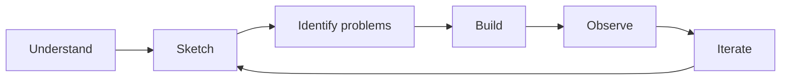

# SaaS Security Lab

A hands-on project to demonstrate a simple **Security by Design** approach on a small SaaS application.

RedRocket Engage is a fictional multi-tenant B2B SaaS.

The goal is not to build a complete SaaS security architecture or apply a security checklist.

The goal is to start from the business problem, understand what the product makes valuable, identify where critical risks appear in the design, and improve the product step by step.

> **Understand first. Build. Observe. Improve.**

## Start with the business

Small B2B teams often manage customer information across spreadsheets, shared files and disconnected tools.

RedRocket provides a shared workspace where an organization can manage:

* users
* contacts
* campaigns

Its value comes from centralizing customer information and making it available to the right people inside the organization.

That value also creates trust.

Customers rely on RedRocket to store their data, control who can access it and keep their organization separated from others using the same service.

This is where the security problem begins.

## Three critical risks

For the first iterations, RedRocket focuses on three outcomes that should not be possible.

### 1. Unauthorized access to customer data

A user from one organization must not be able to access data belonging to another organization.

### 2. Unauthorized privileged control

An attacker must not be able to obtain or abuse administrative capabilities.

### 3. Broad compromise from a limited foothold

Compromising one part of RedRocket should not unnecessarily provide access to the rest of the application or its data.

These three risks are not intended to represent every possible SaaS threat.

They define a deliberately small security scope for the lab.

## Security by Design

Security starts with the product and its architecture, not with tools.

We do not begin with a framework, a list of controls or a predefined security stack.

We first understand:

* what problem the product solves
* what value it creates
* what the customer entrusts to it
* what could materially damage that value
* where the design makes that possible

Then we build.



New security questions are added only when the product or architecture gives them a reason to exist.

## From risk to evidence

Each security problem should follow the same reasoning:

```text
Business value
     ↓
Critical risk
     ↓
Where does it appear?
     ↓
Why does the design allow it?
     ↓
What is the smallest appropriate treatment?
     ↓
Can we demonstrate that it works?
```

For example:

```text
Customer data has value
        ↓
Another tenant must not access it
        ↓
A resource is retrieved only by its ID
        ↓
Tenant ownership is not verified
        ↓
Access is bound to the current organization
        ↓
A cross-tenant request is rejected by a test
```

The interesting part is not the control itself.

It is the reasoning that led to it.

## The product

RedRocket stays intentionally small.

The MVP allows an organization to:

* manage users
* manage contacts
* create campaigns

No real email delivery yet.

The first version is a monolith with one application and one database.

The application only needs enough functionality to expose meaningful security problems.

## The deliverable

RedRocket will become a small working application, not only an architecture exercise.

The repository should eventually contain:

```text
saas-security-lab/
├── app/
├── tests/
├── docs/
│   └── adr/
├── Dockerfile
└── README.md
```

The application and its security tests will also provide a reusable workload for a separate **DevSecOps lab**.

This repository focuses on:

**understanding the business → designing the product → identifying risk → treating it → demonstrating the result**

The DevSecOps lab will focus on continuously verifying those security properties during development.

## Current status

The first foundations are defined:

* business problem
* product value
* MVP
* architecture foundations
* three critical security risks
* architecture decision process
* monolithic architecture

Next:

**Choose the minimum application stack and start building.**

Project documentation:

* [Business Context](docs/business-context.md)
* [Architecture Foundations](docs/architecture-foundations.md)
* [Minimum Viable Product](docs/mvp.md)
* [Security Problems](docs/security-problems.md)
* [Roadmap](ROADMAP.md)
* [Architecture Decisions](docs/adr/)

## Build. Break. Understand. Rebuild better.
