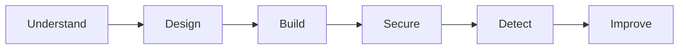

# Roadmap

The lab follows a simple path:

The important part is not the number of security tools added along the way.

Each step should create questions that explain why the next one exists.

## 1. Understand

### Done

- [x] Define RedRocket Engage
- [x] Define the product
- [x] Define the main users
- [x] Identify sensitive data
- [x] Identify the crown jewels
- [x] Identify the main attacker objectives
- [x] Identify supply chain risk
- [x] Define the first security principles

The goal is simple:

understand what matters before deciding how to protect it.

## 2. Design

### Done

- [x] Define the smallest useful product
- [x] Define the first business relationships
- [x] Define the smallest technical architecture
- [x] Identify tenant isolation as a core security property
- [x] Identify authentication requirements
- [x] Identify authorization requirements
- [x] Identify the first data protection questions
- [x] Identify the first trust boundaries

### Next

- [ ] Define the minimum application data model
- [ ] Define the first user roles
- [ ] Define the minimum permissions
- [ ] Define the minimum MVP scope

The goal is not to design the final architecture.

It is to understand the smallest architecture well enough to build it.

## 3. Build

- [ ] Choose the minimum application stack
- [ ] Build the application skeleton
- [ ] Add the database
- [ ] Add organizations
- [ ] Add users
- [ ] Add contacts
- [ ] Add campaigns
- [ ] Add authentication
- [ ] Add basic authorization
- [ ] Expose a small REST API
- [ ] Run the first working MVP

No real email delivery in this lab for now.

While building, document the new security problems that appear.

## 4. Secure

Once the MVP exists and I understand how it works:

- [ ] Review the new attack surface
- [ ] Build the first threat model
- [ ] Review trust boundaries
- [ ] Test tenant isolation
- [ ] Review authentication
- [ ] Review authorization
- [ ] Apply least privilege
- [ ] Protect application secrets
- [ ] Review dependency risk
- [ ] Add security testing where it solves a real problem
- [ ] Review the CI/CD attack surface

The goal is not to add every possible security tool.

Each control should answer a real risk.

## 5. Detect

- [ ] Identify useful security events
- [ ] Centralize relevant logs
- [ ] Define a few meaningful detections
- [ ] Detect suspicious administrative activity
- [ ] Detect authentication anomalies
- [ ] Keep enough evidence to investigate an incident

## 6. Improve

- [ ] Simulate one realistic security incident
- [ ] Investigate it using the available logs
- [ ] Identify what was difficult to detect
- [ ] Identify what was difficult to understand
- [ ] Improve the architecture
- [ ] Update the threat model
- [ ] Update the risk priorities
- [ ] Document lessons learned

## Later

Only if the project gives me a good reason to explore them:

- AWS architecture
- Terraform
- container security
- DAST
- WAF
- webhooks
- third-party integrations
- real email delivery
- advanced CI/CD controls
- customer security questionnaires
- AI features

The roadmap is expected to change.

That's part of the lab.
