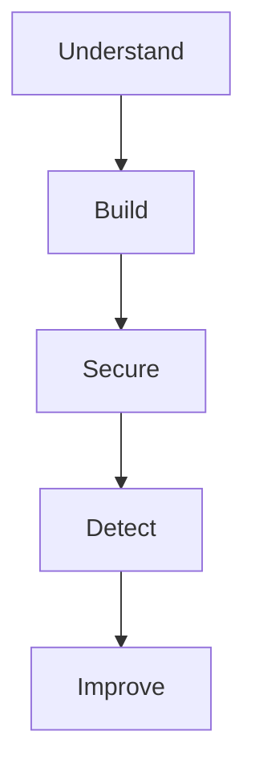

# Roadmap

The lab follows a simple path:

## 1. Understand

### Done

- [x] Define RedRocket Engage
- [x] Define the product
- [x] Define the main users
- [x] Identify sensitive data
- [x] Identify the crown jewels
- [x] Identify the main attacker objectives
- [x] Identify supply chain risk
- [x] Define the first security principles

### Next

- [ ] Define basic availability requirements
- [ ] Define basic customer security expectations

The goal here is simple:

understand what matters before choosing how to protect it.

## 2. Build

- [ ] Finalize the minimum architecture
- [ ] Choose the minimum AWS services required
- [ ] Build the application
- [ ] Add PostgreSQL
- [ ] Add authentication
- [ ] Add organizations and users
- [ ] Add contacts
- [ ] Add campaigns
- [ ] Add basic RBAC
- [ ] Expose a small REST API
- [ ] Deploy the first working version

No real email delivery in this lab for now.

## 3. Secure

Once the application exists and I understand how it works:

- [ ] Build the first threat model
- [ ] Identify trust boundaries
- [ ] Test tenant isolation
- [ ] Review authentication
- [ ] Review authorization
- [ ] Apply least privilege
- [ ] Protect application and cloud secrets
- [ ] Add SAST
- [ ] Add SCA
- [ ] Add secret scanning
- [ ] Perform basic API security testing
- [ ] Review the CI/CD attack surface

The goal is not to add every possible security tool.

Each control should answer a real risk.

## 4. Detect

- [ ] Identify useful security events
- [ ] Centralize relevant logs
- [ ] Define a few meaningful detections
- [ ] Detect suspicious administrative activity
- [ ] Detect authentication anomalies
- [ ] Keep enough evidence to investigate an incident

## 5. Improve

- [ ] Simulate one realistic security incident
- [ ] Investigate it using the available logs
- [ ] Identify what was difficult to detect
- [ ] Identify what was difficult to understand
- [ ] Improve the architecture
- [ ] Update the threat model
- [ ] Update the risk priorities
- [ ] Document lessons learned

## Later

Only if the project gives me a good reason to explore them:

- Terraform
- container security
- DAST
- WAF
- webhooks
- third-party integrations
- real email delivery
- advanced CI/CD controls
- customer security questionnaires
- AI features

The roadmap is expected to change.

That's part of the lab.
