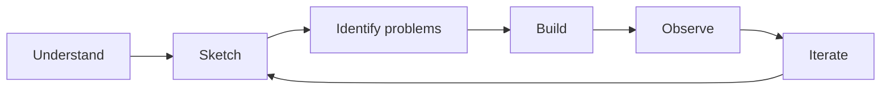

# Roadmap

This project starts from a blank page.

I do not want to define the final architecture, security controls or technology
stack before understanding why they are needed.

The process is deliberately simple:

## 1. Understand

Start with the business.

- What are we building?
- Who is it for?
- What does it need to do?
- What data does it handle?
- What really matters?

Do not think about security products yet.

Do not think about AWS yet.

Do not think about OWASP yet.

First understand the problem.

## 2. Sketch

Draw the smallest possible product and architecture.

Only add a component when the product actually needs it.

For each component, understand:

- why it exists
- what it does
- what it communicates with
- what it has to trust

The goal is not to design the final architecture.

The goal is to understand the next 50 cm.

## 3. Identify problems

Before trying to secure anything, identify the security problems created by
what has just been designed.

Ask:

- What could go wrong?
- What could be accessed?
- What could be modified?
- What could disappear?
- What are we trusting?
- What happens if that trust is wrong?

Document the problems.

Do not solve all of them yet.

## 4. Build

Build the smallest useful version of RedRocket.

Implementation decisions will create new relationships, dependencies and
assumptions.

That is expected.

## 5. Observe

Look at what actually exists now.

Ask again:

- What changed?
- What new security problems appeared?
- What assumptions turned out to be wrong?
- What became more important?
- What became unnecessary?

Add those problems to the project.

## 6. Iterate

Improve the product and the architecture one step at a time.

Security controls, frameworks and technologies should appear when there is
a real problem that gives them a reason to exist.

The architecture is not known in advance.

Neither is the final security architecture.

Both will emerge as RedRocket grows.

## Current step

**Understand → Sketch → Identify problems**

Before coding the MVP, the current work is limited to:

- understanding the business context
- defining the smallest useful product
- sketching the smallest possible architecture
- identifying the first security problems

Then we build.

## Build. Break. Understand. Rebuild better.
