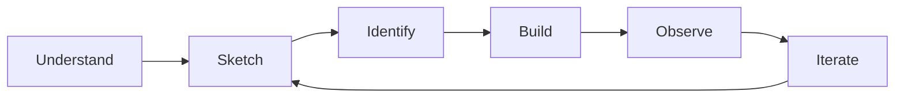

# Roadmap

This project starts from a blank page.

The objective is not to define the final architecture, security controls or technology stack in advance.

The project starts from the business value RedRocket is meant to create, identifies what must remain true for that value to survive, then builds only enough to observe where concrete vulnerabilities actually appear.

The process is deliberately simple:



## 1. Understand

Start with the business:

- What problem does RedRocket solve?
- Who is it for?
- What value does it create?
- What does the customer entrust to it?
- What must remain true for that value to be preserved?

This is where the first security objectives appear.

They exist before the first technical choice because they are derived from the business value and trust created by the product.

**Status: done for the first iteration.**

## 2. Sketch

Draw the smallest possible product and architecture.

Only add a component when the product actually needs it.

For each component or relationship, understand:

- why it exists
- what it does
- what it communicates with
- what it has to trust
- which security objective it can affect

The goal is not to design the final architecture.

The goal is to understand the next useful step.

**Status: first foundations defined.**

## 3. Identify

Relate the architecture back to the security objectives.

At this stage, we are not looking for every possible vulnerability.

We identify where the design creates areas that deserve attention:

- customer and tenant boundaries
- identity and privileged capabilities
- application and data trust

These are architecture concerns, not confirmed vulnerabilities.

**Status: first architecture concerns identified.**

## 4. Build

The first MVP is defined.

Only the architecture decisions required to build it should be made.

Important decisions are recorded as ADRs so that the choice and its security consequences remain understandable.

The first decision is to keep the MVP as a monolith rather than introduce microservices before the product needs them.

Next:

- choose the minimum application stack
- build the smallest working version
- avoid unnecessary infrastructure
- keep the code easy to understand and test
- observe where concrete vulnerabilities appear

Implementation will create real relationships, dependencies and assumptions.

That is where security stops being theoretical.

**Status: current step.**

## 5. Observe

Once the first working slice exists, examine what the implementation actually created.

Ask:

- Can one customer reach another customer's data?
- Can a user obtain or abuse privileged capabilities?
- Can a limited compromise create unnecessary access elsewhere?
- Which assumptions made during design were wrong?
- Which architecture concerns became concrete vulnerabilities?
- Which concerns did not materialize?

Document what actually exists.

Do not add controls for problems that have not appeared.

## 6. Treat

When a concrete vulnerability is found:

1. relate it to the security objective it threatens
2. identify why the current design or implementation allows it
3. apply the smallest appropriate treatment
4. avoid introducing unnecessary complexity

The treatment should remain understandable from the original business need.

## 7. Demonstrate

A treatment is not complete until its effect can be shown.

Where possible, demonstrate:

```text
Before
    ↓
Vulnerability exists
    ↓
Treatment
    ↓
After
    ↓
Security property verified
```

Automated tests should be added when they provide useful evidence and prevent the same weakness from being reintroduced.

These tests will later provide a natural bridge to the DevSecOps lab.

## 8. Iterate

Update the product and architecture one step at a time.

New security objectives, architecture concerns, controls or technologies should only appear when the product gives them a reason to exist.

The final architecture is not known in advance.

Neither is the final security architecture.

Both will emerge as RedRocket grows.

## Current step

**Build**

The business context, MVP, three security objectives and first architecture concerns are defined.

The project is now moving from design into implementation:

```text
Business value
    ↓
Security objectives
    ↓
Architecture concerns
    ↓
Build
    ↓
Concrete vulnerabilities
    ↓
Treatment
    ↓
Evidence
    ↓
Iterate
```

Next:

**Choose the minimum application stack and build the first working RedRocket slice.**
