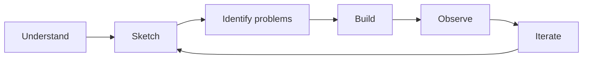

# Roadmap

This project starts from a blank page.

I do not want to define the final architecture, security controls or technology
stack before understanding why they are needed.

The process is deliberately simple:



## 1. Understand

Start with the business:

- What are we building?
- Who is it for?
- What does it need to do?
- What data does it handle?
- What really matters?

Do not start with AWS, OWASP or security products. First understand the problem.

**Status: done for the first iteration.**

## 2. Sketch

Draw the smallest possible product and architecture. Only add a component when
the product actually needs it.

For each component, understand:

- why it exists
- what it does
- what it communicates with
- what it has to trust

The goal is not to design the final architecture. The goal is to understand
the next 50 cm.

**Status: first foundations defined.**

## 3. Identify problems

Before trying to secure anything, identify the security problems created by
what has just been designed.

Ask:

- What could go wrong?
- What could be accessed?
- What could be modified?
- What could disappear?
- What are we trusting?
- What happens if that trust is wrong?

Document the problems. Do not solve all of them yet.

**Status: first security problems documented.**

## 4. Build

The first MVP is now defined.

The next step is to make only the architecture decisions required to build it.
Important decisions are recorded as ADRs so that both the choice and its
security consequences remain understandable.

The first decision is to keep the MVP as a monolith rather than introduce
microservices before the product needs them.

Next:

- choose the minimum application stack
- build the smallest working version
- avoid unnecessary infrastructure
- document new security problems as they appear

Implementation will create new relationships, dependencies and assumptions.

That is expected.

## 5. Observe

Once the MVP exists, look at what actually changed:

- What new security problems appeared?
- What new trust relationships exist?
- What assumptions turned out to be wrong?
- What became more important?
- What became unnecessary?

Update the architecture and security problems from what actually exists.

## 6. Iterate

Improve the product and architecture one step at a time.

Security controls, frameworks and technologies should appear when there is a
real problem that gives them a reason to exist.

The final architecture is not known in advance. Neither is the final security
architecture.

Both will emerge as RedRocket grows.

## Current step

**Build**

The business context, architecture foundations, first security problems and MVP
are defined.

The project is now moving from design into implementation:

```text
MVP
 ↓
Architecture decision
 ↓
Build
 ↓
Observe
 ↓
New security problems
```

Keep it small. Build the first working RedRocket.
