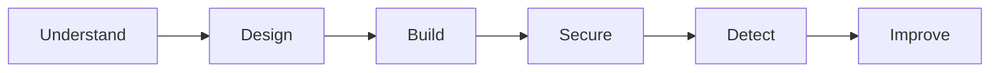

# Roadmap

The lab follows a simple path:

The important part is not how many security tools, controls or frameworks
appear in the project.

At this stage, I do not care about starting with OWASP, a WAF, SAST, DAST
or a predefined security checklist.

Those things may become useful later, but only when the product gives me
a reason to use them.

What matters first is identifying the security problems that already exist
in the simplest possible version of the product.

Then, every time RedRocket grows, I will ask the same questions again:

- What changed?
- What new component or relationship did we introduce?
- What does it trust?
- What data crosses that boundary?
- What could go wrong?
- What new security problem does that create?

The security architecture will therefore grow with the product.

The goal is to progressively build a global view of RedRocket security from
real architectural and business problems, rather than starting from a list
of controls and trying to fit the product into it.

## 1. Understand

### Done

- [x] Define RedRocket Engage
- [x] Define the product
- [x] Define the main users
- [x] Identify sensitive data
- [x] Identify the crown jewels
- [x] Identify the main attacker objectives
- [x] Identify supply chain risk
- [x] Define the first security principles

The goal is simple:

understand what matters before deciding how to protect it.

## 2. Design

### Done

- [x] Define the smallest useful product
- [x] Define the first business relationships
- [x] Define the smallest technical architecture
- [x] Identify tenant isolation as a core security property
- [x] Identify authentication requirements
- [x] Identify authorization requirements
- [x] Identify the first data protection questions
- [x] Identify the first trust boundaries

### Next

- [ ] Define the minimum application data model
- [ ] Define the first user roles
- [ ] Define the minimum permissions
- [ ] Define the minimum MVP scope

The goal is not to design the final architecture.

It is to understand the smallest architecture well enough to build it and
to identify the security problems that already exist before writing code.

## 3. Build

- [ ] Choose the minimum application stack
- [ ] Build the application skeleton
- [ ] Add the database
- [ ] Add organizations
- [ ] Add users
- [ ] Add contacts
- [ ] Add campaigns
- [ ] Add authentication
- [ ] Add basic authorization
- [ ] Expose a small REST API
- [ ] Run the first working MVP

No real email delivery in this lab for now.

While building, document the new security problems that appear.

Every new component, feature or relationship may introduce:

- new data
- new trust assumptions
- new attack paths
- new permissions
- new dependencies
- new failure modes

Those problems will drive the next security decisions.

## 4. Secure

Security is not a separate layer added after the product is built.

By this stage, many security problems should already have been identified
during design and implementation.

This phase is where I step back, connect those problems together and start
building a broader view of the security architecture.

- [ ] Review the new attack surface
- [ ] Build the first threat model
- [ ] Review trust boundaries
- [ ] Test tenant isolation
- [ ] Review authentication
- [ ] Review authorization
- [ ] Apply least privilege
- [ ] Protect application secrets
- [ ] Review dependency risk
- [ ] Review the CI/CD attack surface
- [ ] Add security testing where it solves a real problem

OWASP, WAFs, SAST, DAST or other controls may appear here, but only when
they answer a problem that RedRocket has actually created.

The tool is not the starting point.

The problem is.

## 5. Detect

Once RedRocket starts doing useful things, it also needs to provide enough
information to understand when something unusual happens.

- [ ] Identify useful security events
- [ ] Centralize relevant logs
- [ ] Define a few meaningful detections
- [ ] Detect suspicious administrative activity
- [ ] Detect authentication anomalies
- [ ] Keep enough evidence to investigate an incident

Detection should follow the same principle:

do not collect everything just because it can be collected.

Start with the events that help explain the risks already identified.

## 6. Improve

- [ ] Simulate one realistic security incident
- [ ] Investigate it using the available logs
- [ ] Identify what was difficult to detect
- [ ] Identify what was difficult to understand
- [ ] Improve the architecture
- [ ] Update the threat model
- [ ] Update the risk priorities
- [ ] Document lessons learned

Each iteration should improve both the product and the understanding of its
security architecture.

## Later

Only if the project gives me a good reason to explore them:

- AWS architecture
- Terraform
- container security
- DAST
- WAF
- webhooks
- third-party integrations
- real email delivery
- advanced CI/CD controls
- customer security questionnaires
- AI features

The roadmap is expected to change.

That's part of the lab.

* Build. Break. Understand. Rebuild better.
