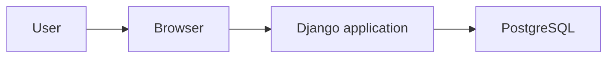

# ADR-0003: Use Django and PostgreSQL for the first application stack

## Status

Accepted

## Context

RedRocket is now moving from design into implementation.

The objective is to ship the smallest useful SaaS quickly enough to observe real application behavior and real security problems.

The first version remains a modular monolith:

- one deployable application
- one database
- clear internal boundaries between identity/users, contacts and campaigns
- server-side rendering
- no distributed infrastructure

The stack must support the current Security by Design objectives without introducing unnecessary engineering work.

The priority is time-to-market:

> **Ship the smallest thing that lets me learn something important.**

## Decision

RedRocket will use:

- **Python**
- **Django**
- **PostgreSQL**
- **server-side rendered HTML**

The application will remain a single deployable Django project organized around understandable internal modules.

No separate frontend framework or public API is required for the first version.

## Why Django

Django provides enough application behavior out of the box to reach a real working SaaS quickly.

It gives RedRocket the basic capabilities needed for the MVP without requiring custom plumbing for:

- users
- authentication
- sessions
- forms
- templates
- ORM
- migrations
- automated tests

This keeps the implementation effort focused on the Product Security questions that matter to RedRocket:

- tenant isolation
- authorization
- privileged capabilities
- data access
- sessions and browser trust
- concrete application vulnerabilities

The goal is not to study how to build an authentication framework.

The goal is to study whether RedRocket preserves its security objectives once real application behavior exists.

## Why PostgreSQL

RedRocket needs a relational database for organizations, users, contacts and campaigns.

PostgreSQL provides a realistic application-to-database trust relationship while remaining simple enough for the MVP.

This also keeps the third security objective observable:

**Limit the impact of compromise.**

The way the application reaches and accesses data will later help determine the blast radius of an application compromise.

## Why server-side rendering

A separate frontend application would create additional components, APIs and trust relationships before the product needs them.

The first version therefore keeps the request path simple:



This is enough to build the product and observe meaningful AppSec behavior.

## Internal structure

The code should keep the current business areas understandable:

```text
redrocket/
├── identity/
├── contacts/
├── campaigns/
└── config/
```

These are internal code boundaries only.

They are not separate services and do not imply a future microservices architecture.

The structure may evolve if the product gives us a concrete reason to change it.

## Alternatives not selected

### FastAPI

FastAPI would also support the MVP, but would require more application plumbing around the server-side SaaS behavior we need immediately.

That additional work does not currently improve the Security by Design learning objective.

### Flask

Flask would provide an even smaller foundation, but would require additional choices and integration work for functionality Django already provides.

### Separate frontend application

A SPA or separate frontend would introduce an API boundary, additional state handling and more moving parts without solving a current RedRocket problem.

## Consequences

### Positive

- faster path to a working SaaS
- fewer infrastructure and framework decisions
- authentication and session behavior exist early enough to study
- tenant-aware authorization can be implemented and tested quickly
- PostgreSQL preserves a real application-to-database trust relationship
- the application remains easy to understand as one deployable unit

### Trade-offs

- RedRocket accepts Django conventions instead of minimizing framework influence
- some security behavior is provided by the framework rather than implemented from scratch
- the application is initially coupled to Django and its ORM

These trade-offs are acceptable because the current objective is to learn from real Product Security behavior, not to maximize architectural portability.

## Next step

Build the smallest working slice:

```text
Organization
    ↓
User
    ↓
Login
    ↓
Contacts
```

Create at least two organizations with separate users and contacts.

Then test whether a user from one organization can directly access a contact belonging to another organization.

That will give RedRocket its first real authorization path to observe.
