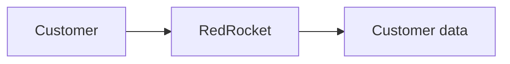
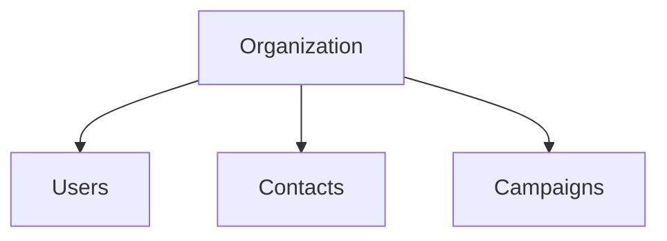
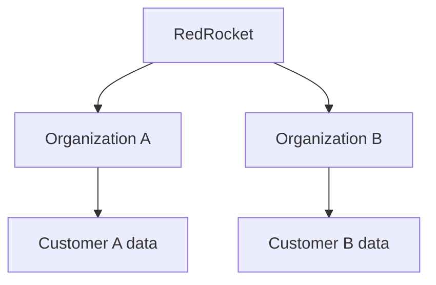
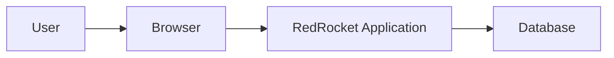
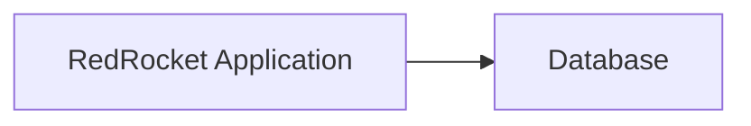
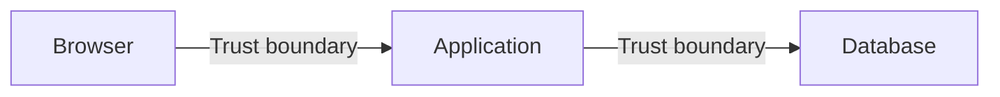

# Architecture Foundations

## Starting from nothing

RedRocket starts with one simple idea:

> a customer uses a service and trusts it with data.

Before choosing a framework, a cloud provider or a security product, I want to understand what this simple relationship already implies.

At this point there is no AWS architecture, no container platform, no CI/CD pipeline and no security tooling.

There is only a business need and a system that has to satisfy it.

## The first relationship

The smallest possible view of RedRocket is:

The customer expects RedRocket to store and use that data in a way that supports the business need.

This already creates trust.

## The smallest product

RedRocket is a multi-tenant SaaS application.

Each customer has its own organization containing:

- users
- contacts
- campaigns

The first version does not send real email.

This is enough to start seeing where security matters.

## First security concern: customer and tenant boundaries

RedRocket serves more than one customer.

The moment several organizations share the same service, RedRocket must preserve a clear boundary between them.

A user from one organization must not be able to access data belonging to another organization.

This concern is directly related to the first critical outcome:

**Unauthorized access to customer data.**

At this stage, there is no confirmed vulnerability. There is a design property that must remain true when the application is implemented.

## Second security concern: identity and privileged capabilities

An organization contains users with different responsibilities.

Members work with contacts and campaigns.

Administrators can also manage users, roles and organization settings.

RedRocket therefore needs to answer two basic questions:

- Who is acting?
- What is this identity allowed to do?

The implementation is not decided yet.

What matters is that privileged capabilities exist, and the product must keep them under authorized control.

This concern is directly related to the second critical outcome:

**Unauthorized privileged control.**

## The smallest technical architecture

Only now do I need a first technical view.

Three technical components are enough:

1. a browser
2. an application
3. a database

The technology used to implement them is secondary for now.

The goal is to understand the relationships between them.

## Browser to application

The browser is controlled by the user and sits outside the application's trust boundary.

Requests and data coming from it cannot automatically be trusted.

This does not yet define a specific security problem. It identifies a boundary that will need to be observed during implementation.

## Third security concern: application and data trust

The application needs to read and modify customer data stored in the database.

That creates a trust relationship between the application and the data it can reach.

The amount of access given to the application will influence the impact of a compromise.

If one part of RedRocket is compromised, that should not automatically provide unnecessary access to the rest of the application or its data.

This concern is directly related to the third critical outcome:

**Broad compromise from a limited foothold.**

The actual blast radius will depend on the implementation choices made during the build.

## The first trust boundaries

The smallest architecture contains two obvious trust boundaries:

Each boundary is a place where assumptions have to be questioned:

- What crosses the boundary?
- Who controls it?
- Why should the receiving component trust it?
- What happens if that trust is abused?

These questions help identify where concrete security problems may appear once the application exists.

## What is deliberately missing

The architecture does not currently include:

- cloud infrastructure
- containers or orchestration
- public APIs
- CI/CD and infrastructure as code
- security testing tooling
- WAF, SIEM, logging or detection tooling

Those components are not excluded permanently.

They will only be introduced if the product or architecture creates a reason for them to exist.

## What we have learned before coding

The smallest RedRocket design already reveals three areas that deserve security attention:

- customer and tenant boundaries
- identity and privileged capabilities
- application and data trust

These are security concerns, not confirmed vulnerabilities.

They exist because of the way the product works and the trust relationships created by the architecture.

## What comes next

The MVP is defined and the first architecture decision has been made: RedRocket will start as a monolith.

The next step is to choose the minimum application stack and build the first working version.

From there, we will observe where concrete security problems appear, treat them and demonstrate the result.
