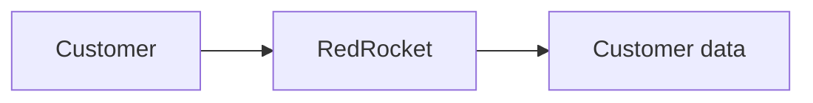
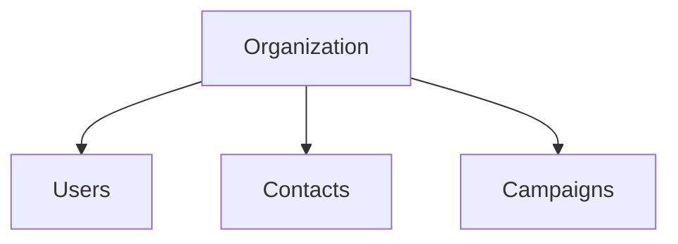
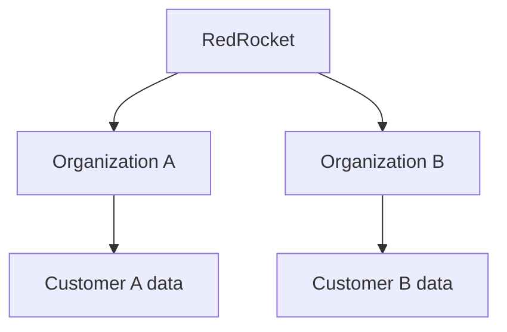
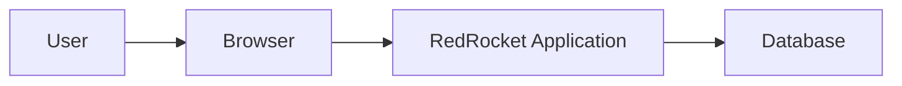
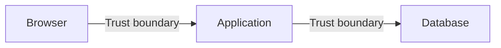

# Architecture Foundations

## Starting from nothing

RedRocket starts with one simple idea:

> a customer uses a service and trusts it with data.

Before choosing a framework, a cloud provider or a security product, I want to
understand what this simple relationship already implies. At this point there is
no AWS architecture, no container platform, no CI/CD pipeline and no security
tooling.

There is only a business need and a system that has to satisfy it.

## The first relationship

The smallest possible view of RedRocket is:

Even this creates security questions. The customer expects the data to:

- remain confidential
- remain correct
- remain available when needed

Confidentiality, integrity and availability do not come from a security
framework. They come directly from what the product is supposed to do.

## The smallest product

RedRocket is a multi-tenant SaaS application. Each customer has its own
organization containing:

- users
- contacts
- campaigns

The first version does not send real email. That is enough for now.

## First security problem: tenant isolation

RedRocket serves more than one customer.

That immediately creates an important security property: **a user from one
organization must never be able to access data belonging to another
organization.**

This is tenant isolation. We have not written any code yet, but one of the most
important security requirements of the application already exists.

## Second security problem: identity

An organization contains users, so RedRocket needs to know who is interacting
with the application. The first question is simple: **Who are you?**

This is authentication. Without a reliable identity, the application cannot
make meaningful access decisions.

## Third security problem: permissions

Knowing who the user is is not enough. Two users from the same organization may
not have the same responsibilities.

RedRocket therefore also needs to answer: **What are you allowed to do?**

This is authorization. Later this may lead to roles and permissions, but the
requirement exists before choosing how to implement them.

## Fourth security problem: customer data

Contacts contain customer-owned information such as:

- first name
- last name
- email address
- company

This immediately creates more questions:

- Who can read this data?
- Who can modify it?
- Who can export it?
- What happens if it is modified incorrectly?
- What happens if it is lost?
- What should appear in logs?
- How long should it be kept?

Data protection is therefore part of the application design, not something
added after deployment.

## The smallest technical architecture

Only now do I need a first technical view.

Three technical components are enough:

1. a browser
2. an application
3. a database

The technology used to implement them is secondary for now. The goal is to
understand the relationships between them.

## Browser to application

The browser sends requests and data to RedRocket. The application cannot assume
that everything received from the browser is legitimate.

This creates questions around:

- identity
- sessions
- permissions
- input validation
- unexpected or malicious requests

The browser is outside the application's trust boundary.

## Application to database

The application needs to read and modify stored data. That creates another
trust relationship.

The database needs to know which application can connect to it, and the
application needs some way to access it. This creates questions around:

- database authentication
- credentials
- secrets
- least privilege
- database exposure

The implementation is not decided yet. The important point is that a trust
relationship now exists.

## The first trust boundaries

The first architecture therefore contains two obvious trust boundaries:

Each boundary is a place where assumptions have to be questioned:

- What information crosses it?
- Who controls that information?
- Why should the receiving component trust it?
- What happens if that trust is abused?

## What is deliberately missing

The architecture does not currently include:

- cloud infrastructure
- containers or orchestration
- public APIs
- CI/CD and infrastructure as code
- security testing tooling
- WAF, SIEM, logging or detection tooling

Those may appear later if the product gives us a reason to add them.

## What we have learned before coding

Starting from only a customer, an application and some data has already
revealed several security concerns:

- confidentiality
- integrity
- availability
- tenant isolation
- authentication
- authorization
- customer data protection
- input validation
- secrets
- least privilege
- trust boundaries

None of these appeared because a security checklist told us to add them. They
appeared because of the way the product has to work.

## What comes next

The first MVP is now defined.

The next step is to make the minimum architecture decisions required to build
it. Significant decisions will be documented as Architecture Decision Records.

Then we build, observe what changes and add new security problems when they
actually appear.
