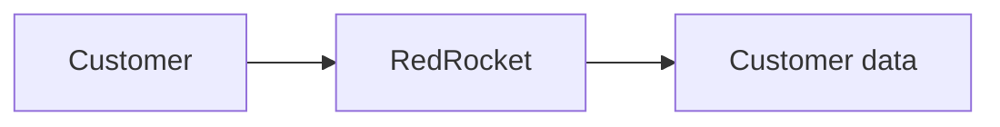
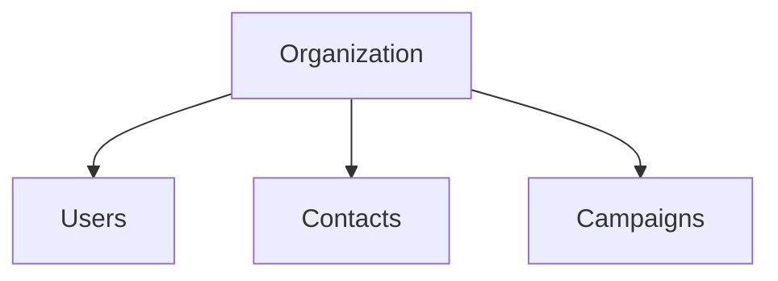
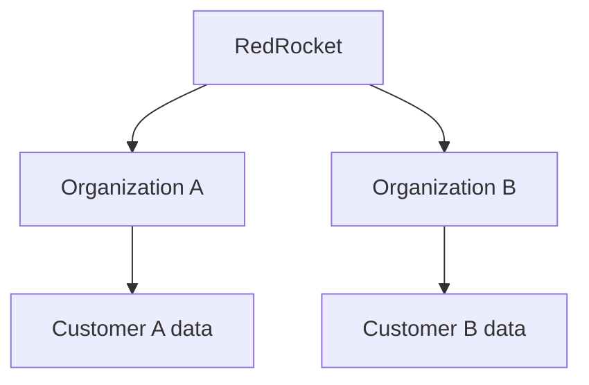
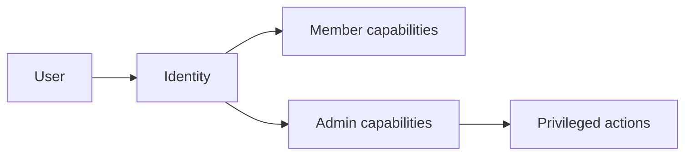
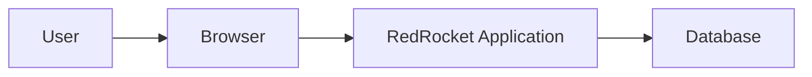
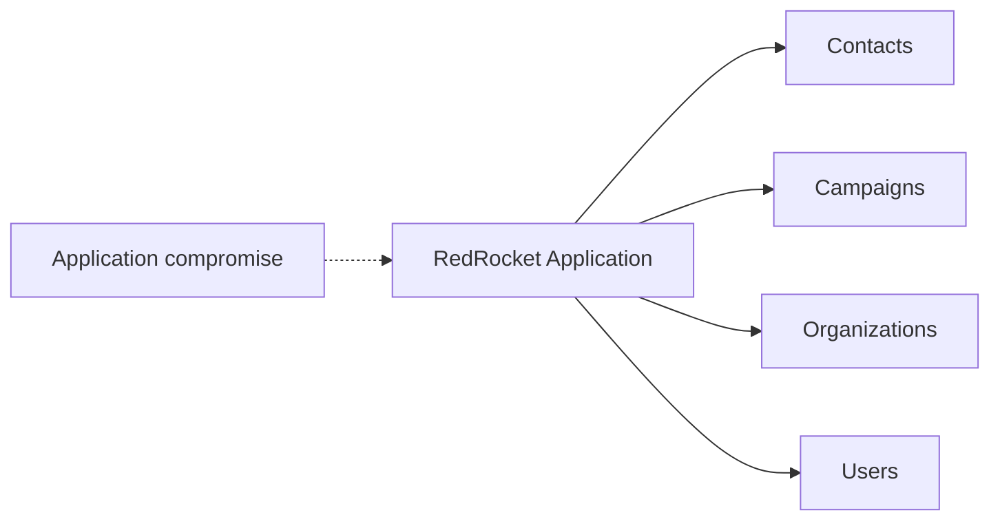
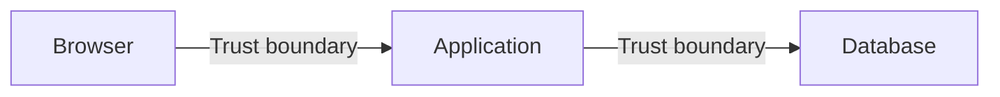

# Architecture Foundations

## Starting from nothing

RedRocket starts with one simple idea:

> a customer uses a service and trusts it with data.

Before choosing a framework, a cloud provider or a security product, I want to understand what this simple relationship already implies.

At this point there is no AWS architecture, no container platform, no CI/CD pipeline and no security tooling.

There is only a business need and a system that has to satisfy it.

## The first relationship

The smallest possible view of RedRocket is:

The customer expects RedRocket to store and use that data in a way that preserves the value of the service.

The first security objectives therefore exist before the first technical choice.

## The smallest product

RedRocket is a multi-tenant SaaS application.

Each customer has its own organization containing:

- users
- contacts
- campaigns

The first version does not send real email.

This product structure is enough to reveal where the first security objectives meet the design.

## First architecture concern: customer and tenant boundaries

RedRocket serves more than one customer.

The moment several organizations share the same service, the design must preserve a clear boundary between them.

This architecture concern is directly related to the first security objective:

**Preserve customer boundaries.**

At this stage, there is no confirmed vulnerability. There is a property that the implementation will have to preserve.

## Second architecture concern: identity and privileged capabilities

An organization contains users with different responsibilities.

Members work with contacts and campaigns.

Administrators can also manage users, roles and organization settings.

The architecture therefore has to support two basic questions:

- Who is acting?
- What is this identity allowed to do?

This concern is directly related to the second security objective:

**Preserve authorized control.**

The implementation is not decided yet.

## The smallest technical architecture

Only now do I need a first technical view.

Three technical components are enough:

1. a browser
2. an application
3. a database

The technology used to implement them is secondary for now.

The goal is to understand the relationships between them.

## Browser to application

The browser is controlled by the user and sits outside the application's trust boundary.

Requests and data coming from it cannot automatically be trusted.

This does not yet define a concrete security problem. It identifies a boundary that will need to be observed during implementation.

## Third architecture concern: application and data trust

The application needs to read and modify customer data stored in the database.

That creates a trust relationship between the application and the data it can reach.

The amount of access given to the application will influence the impact of a compromise.

This concern is directly related to the third security objective:

**Limit the impact of compromise.**

The actual blast radius will depend on the implementation choices made during the build.

## The first trust boundaries

The smallest technical architecture contains two obvious trust boundaries:

Each boundary is a place where assumptions have to be questioned:

- What crosses the boundary?
- Who controls it?
- Why should the receiving component trust it?
- What happens if that trust is abused?

These questions help identify where concrete security problems may appear once the application exists.

## What is deliberately missing

The architecture does not currently include:

- cloud infrastructure
- containers or orchestration
- public APIs
- CI/CD and infrastructure as code
- security testing tooling
- WAF, SIEM, logging or detection tooling

Those components are not excluded permanently.

They will only be introduced if the product or architecture creates a reason for them to exist.

## What we have learned before coding

Before choosing the application stack, we already know three things that must remain true:

- customer boundaries must be preserved
- privileged capabilities must remain under authorized control
- a limited compromise should not unnecessarily become a broad one

The product architecture then shows us where these objectives may be challenged:

- tenant boundaries
- identity and privileged capabilities
- application and data trust

None of these are confirmed vulnerabilities yet.

The next step is to build and identify where the design or implementation creates concrete vulnerabilities.

## What comes next

The MVP is defined and RedRocket will start as a monolith.

The next step is to choose the minimum application stack and build the first working version.

From there, concrete security problems will be documented, treated and demonstrated.
