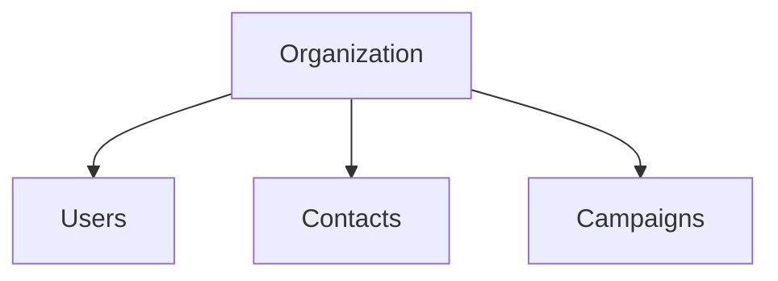

# Minimum Viable Product

RedRocket now needs a first version that is small enough to understand and useful enough to observe.

## Product

The MVP contains four objects:

Every user, contact and campaign belongs to one organization.

## Users

Two roles are enough for the first version:

- **Member:** works with contacts and campaigns inside the organization.
- **Admin:** can additionally manage users and roles.

## Scope

The first MVP allows a user to:

- log in
- view and manage contacts
- create and manage draft campaigns
- log out

An admin can also:

- view users
- create users
- change user roles

That is enough for now.

## Not yet

The MVP does not include:

- public registration
- email delivery
- public API
- integrations
- billing
- advanced campaign features

Those can appear later if the product gives us a reason to add them.

## Current implementation

The first working slice now includes:

- organization-aware users
- login
- contacts
- tenant-aware contact listing and detail access

Campaigns and administrative user/role management remain part of the MVP target
but have not been implemented yet.

The first contact flow has already produced and treated a concrete tenant
isolation vulnerability.

Significant architecture decisions are recorded as Architecture Decision Records,
and confirmed security problems are recorded as Security Findings.
